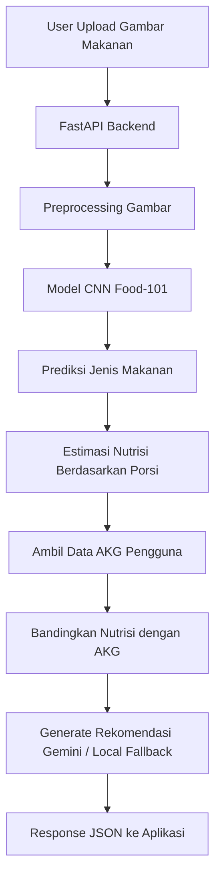

<div align="center">

# 🥗 NutriAI ML

### Sistem Prediksi Risiko Kekurangan Nutrisi Berbasis Pola Asupan Gizi Harian

<p>
  
  
  
  
  
</p>

<p>
  <b>NutriAI ML</b> adalah backend Machine Learning untuk mengenali makanan dari gambar, memperkirakan kandungan nutrisi, membandingkan hasilnya dengan kebutuhan AKG, dan memberikan rekomendasi gizi berbasis AI.
</p>

</div>

---

## 📌 Deskripsi Project

**NutriAI ML** merupakan bagian Machine Learning dan Backend API dari sistem **Prediksi Risiko Kekurangan Nutrisi Berbasis Pola Asupan Gizi Harian**.

Sistem ini dirancang untuk membantu pengguna memahami asupan gizi dari makanan yang dikonsumsi setiap hari. Pengguna dapat mengunggah gambar makanan, kemudian sistem akan melakukan prediksi jenis makanan, estimasi kandungan nutrisi, membandingkan hasilnya dengan kebutuhan AKG harian, dan memberikan rekomendasi gizi.

> ⚠️ Sistem ini bersifat estimasi dan edukatif. Hasil prediksi tidak menggantikan diagnosis atau konsultasi dengan dokter maupun ahli gizi.

---

## ✨ Fitur Utama

| Fitur | Deskripsi |
|---|---|
| 🖼️ Prediksi Gambar Makanan | Mengklasifikasikan jenis makanan berdasarkan gambar yang diunggah pengguna |
| 🍽️ Estimasi Nutrisi | Mengestimasi kandungan kalori, protein, karbohidrat, lemak, serat, kalsium, zat besi, dan vitamin C |
| 📏 Input Porsi | Mendukung input berat makanan dalam gram |
| 👤 Profil Pengguna | Mempertimbangkan usia, jenis kelamin, dan kondisi pengguna |
| 📊 Perbandingan AKG | Membandingkan estimasi nutrisi dengan kebutuhan gizi harian pengguna |
| 🤖 Rekomendasi AI | Memberikan rekomendasi gizi menggunakan Gemini atau fallback lokal |
| ⚡ REST API | Menyediakan endpoint inference menggunakan FastAPI |

---

## 🧠 Alur Kerja Sistem



---

## 🛠️ Tech Stack

| Kategori | Teknologi |
|---|---|
| Bahasa Pemrograman | Python |
| Machine Learning | TensorFlow, Keras |
| Backend API | FastAPI |
| Server | Uvicorn |
| Data Processing | Pandas, NumPy |
| Image Processing | Pillow |
| Generative AI | Google GenAI / Gemini |
| Dataset | Food-101 |
| Model Format | `.keras` |

---

## 📁 Struktur Repository


```bash
ML/
├── __pycache__/
├── .devcontainer/
├── app/
│   ├── __pycache__/
│   ├── routes/
│   ├── services/
│   └── main.py
├── artifacts/
│   ├── akg_breastfeeding.csv
│   ├── akg_normal.csv
│   ├── akg_pregnant.csv
│   ├── best_nutrivision_cnn_food101_akg.keras
│   ├── class_names.json
│   ├── nutrition_table_cleaned.csv
│   └── training_log.csv
├── assets/
│   └── Dicoding_Camp_Logo.jpg
├── notebook/
│   ├── NutriAI_CNN_Food101_101Classes.ipynb
│   └── NutriVision_Food101_Inference.ipynb
├── .gitignore
├── Dockerfile
├── inference.py
├── README.md
└── requirements.txt
```

---

## 🚀 Cara Menjalankan Project

### 1. Clone Repository

```bash
git clone https://github.com/asnalaia/NutriAi-ML.git
cd NutriAi-ML
```

### 2. Buat Virtual Environment

```bash
python -m venv venv
```

Aktifkan virtual environment:

**Windows PowerShell**

```bash
venv\Scripts\activate
```

**Linux / macOS**

```bash
source venv/bin/activate
```

### 3. Install Dependencies

```bash
pip install -r requirements.txt
```

---

## ⚙️ Konfigurasi Environment

Untuk menggunakan rekomendasi berbasis Gemini, siapkan API key terlebih dahulu.

Buat file `.env` atau set environment variable:

```bash
GEMINI_API_KEY=your_gemini_api_key
```

Untuk Windows PowerShell:

```bash
$env:GEMINI_API_KEY="your_gemini_api_key"
```

Untuk Linux / macOS:

```bash
export GEMINI_API_KEY="your_gemini_api_key"
```

> Jika API key Gemini tidak tersedia, sistem tetap dapat menggunakan rekomendasi lokal sebagai fallback.

---

## ▶️ Menjalankan Backend

Jalankan server FastAPI dengan perintah berikut:

```bash
uvicorn app.main:app --reload
```

Server akan berjalan di:

```bash
http://127.0.0.1:8000
```

Dokumentasi API otomatis dapat diakses melalui:

```bash
http://127.0.0.1:8000/docs
```

---

## 🖥️ Menjalankan Frontend Streamlit

Aplikasi frontend prototype dibuat menggunakan Streamlit. Pastikan backend FastAPI sudah berjalan terlebih dahulu.

Jalankan Streamlit dengan perintah:

```bash
streamlit run inference.py
```
Aplikasi akan berjalan di:
```bash
http://localhost:8501
```
---
## Deployment
Backend FastAPI dapat di deploy ke Render menggunakan start command:
```bash
python -m uvicorn app.main:app --host 0.0.0.0 --port $PORT
```
Frontend Streamlit dapat di deploy ke Streamlit Community Cloud. Pada Streamlit Secrets, tambahkan:
```bash
API_URL = "https://url-backend-kamu/api/predict"
```

## 🔥 Endpoint API

### Health Check

```http
GET /
```

Contoh response:

```json
{
  "status": "ok",
  "message": "NutriVision AI Backend aktif"
}
```

---

### Prediksi Makanan dan Nutrisi

```http
POST /api/predict
```

Endpoint ini digunakan untuk mengunggah gambar makanan, memprediksi jenis makanan, menghitung estimasi nutrisi, membandingkan dengan AKG, dan menghasilkan rekomendasi gizi.

#### Form Data

| Parameter | Tipe | Default | Deskripsi |
|---|---:|---:|---|
| `file` | File | Wajib | Gambar makanan yang akan diprediksi |
| `porsi_gram` | float | `100.0` | Berat porsi makanan dalam gram |
| `age` | int | `21` | Usia pengguna |
| `sex` | string | `female` | Jenis kelamin pengguna |
| `condition` | string | `normal` | Kondisi pengguna, misalnya `normal`, `pregnant`, atau `breastfeeding` |
| `pregnancy_month` | int | `0` | Bulan kehamilan, jika pengguna sedang hamil |
| `breastfeeding_month` | int | `0` | Bulan menyusui, jika pengguna sedang menyusui |

---

## 📤 Contoh Request

```bash
curl -X POST "http://127.0.0.1:8000/api/predict" \
  -F "file=@sample_food.jpg" \
  -F "porsi_gram=150" \
  -F "age=21" \
  -F "sex=male" \
  -F "condition=normal"
```

---

## 📥 Contoh Response

```json
{
  "status": "success",
  "makanan": "apple_pie",
  "class_name": "apple_pie",
  "confidence_persen": 92.45,
  "porsi_gram": 150,
  "profil_pengguna": {
    "age": 21,
    "sex": "male",
    "condition": "normal",
    "pregnancy_month": 0,
    "breastfeeding_month": 0
  },
  "estimasi_nutrisi": {
    "calories_kcal": 355.5,
    "protein_g": 4.2,
    "carbs_g": 52.1,
    "fat_g": 14.3,
    "fiber_g": 3.1,
    "calcium_mg": 25.6,
    "iron_mg": 1.2,
    "vitamin_c_mg": 2.5
  },
  "target_akg": {
    "calories_kcal": 2650,
    "protein_g": 65,
    "carbs_g": 430,
    "fat_g": 75,
    "fiber_g": 37,
    "calcium_mg": 1000,
    "iron_mg": 9,
    "vitamin_c_mg": 90
  },
  "komparasi_akg": [
    {
      "nutrient": "calories_kcal",
      "predicted_amount": 355.5,
      "daily_target_akg": 2650,
      "percent_of_daily_need": 13.41
    }
  ],
  "rekomendasi_gemini": "Rekomendasi gizi akan ditampilkan berdasarkan hasil prediksi dan profil pengguna."
}
```

---

## 🧪 Notebook

Repository ini menyediakan notebook untuk proses eksperimen, training, dan inference model.

| Notebook | Fungsi |
|---|---|
| `NutriAI_CNN_Food101_101Classes.ipynb` | Notebook training model CNN untuk klasifikasi 101 kelas makanan Food-101 |
| `NutriVision_Food101_Inference.ipynb` | Notebook untuk melakukan inference atau pengujian prediksi makanan |

---

## 📊 Output Nutrisi

Sistem melakukan estimasi beberapa komponen nutrisi utama berikut:

| Nutrisi | Satuan |
|---|---|
| Kalori | kcal |
| Protein | gram |
| Karbohidrat | gram |
| Lemak | gram |
| Serat | gram |
| Kalsium | mg |
| Zat Besi | mg |
| Vitamin C | mg |

---

## 🧾 Dataset dan Artefak

| File | Keterangan |
|---|---|
| `class_names.json` | Daftar kelas makanan yang dikenali model |
| `nutrition_table_cleaned.csv` | Tabel referensi nutrisi makanan |
| `akg_normal.csv` | Data AKG untuk pengguna dengan kondisi normal |
| `akg_pregnant.csv` | Data AKG untuk pengguna hamil |
| `akg_breastfeeding.csv` | Data AKG untuk pengguna menyusui |
| `training_log.csv` | Riwayat hasil training model |

---

## 🎯 Business Question

Pertanyaan utama yang ingin dijawab oleh sistem ini adalah:

> Apakah sistem dapat mengklasifikasikan makanan dari gambar, mengestimasi kandungan nutrisi berdasarkan porsi, serta membantu mengidentifikasi potensi risiko kekurangan nutrisi berdasarkan perbandingan dengan kebutuhan AKG harian pengguna?

---

## 🧩 Tujuan Project

Project ini dibuat untuk:

- Membantu pengguna memahami kandungan nutrisi dari makanan yang dikonsumsi
- Memberikan estimasi kontribusi makanan terhadap kebutuhan gizi harian
- Menjadi dasar sistem prediksi risiko kekurangan nutrisi
- Mendukung edukasi pola makan sehat dan seimbang
- Menyediakan backend inference yang dapat diintegrasikan dengan aplikasi web atau mobile

---

## 🛡️ Guardrails Rekomendasi AI

Rekomendasi AI pada sistem ini dibatasi hanya untuk konteks:

- Analisis nutrisi makanan
- Pola makan harian
- Rekomendasi makanan sehat
- Perbandingan asupan dengan AKG
- Edukasi gizi umum

Sistem tidak ditujukan untuk:

- Memberikan diagnosis medis
- Menggantikan konsultasi dokter atau ahli gizi
- Menyarankan diet ekstrem
- Memberikan klaim kesehatan tanpa dasar yang jelas

---

## 📌 Roadmap Pengembangan

- [x] Membuat model klasifikasi makanan berbasis CNN
- [x] Membuat notebook training model Food-101
- [x] Membuat notebook inference gambar makanan
- [x] Membuat backend FastAPI
- [x] Menambahkan endpoint prediksi makanan
- [x] Menambahkan estimasi nutrisi berdasarkan porsi
- [x] Menambahkan perbandingan dengan AKG
- [x] Menambahkan rekomendasi Gemini / local fallback
- [ ] Menambahkan histori asupan makanan harian pengguna
- [ ] Menambahkan prediksi risiko kekurangan nutrisi berbasis riwayat konsumsi
- [ ] Menambahkan database pengguna
- [ ] Integrasi dengan frontend web atau mobile
- [ ] Deployment API ke cloud server

---

## ⚠️ Disclaimer

Hasil prediksi makanan, estimasi nutrisi, dan rekomendasi yang diberikan oleh sistem ini bersifat estimasi berbasis model Machine Learning dan data referensi nutrisi.

Sistem ini tidak dimaksudkan sebagai alat diagnosis medis dan tidak menggantikan konsultasi dengan dokter, ahli gizi, atau tenaga kesehatan profesional.

---

## 👨‍💻 Author

**Jason Sanjaya & Asna Laia**  

AI Engineer 

Universitas Sumatera Utara - Dicoding Camp 2026

<table>
    <tr>
      <td align="center" style="padding: 10px;">
        <a href="https://github.com/">
          
        </a>
      </td>
      <td align="center" style="padding: 10px;">
        
      </td>
    </tr>
  </table>
---

<div align="center">

### 🥗 NutriAI ML

**Smart Nutrition Prediction System for Better Daily Eating Awareness**

Made with Python, TensorFlow, Keras, FastAPI, and AI Recommendation.

</div>
